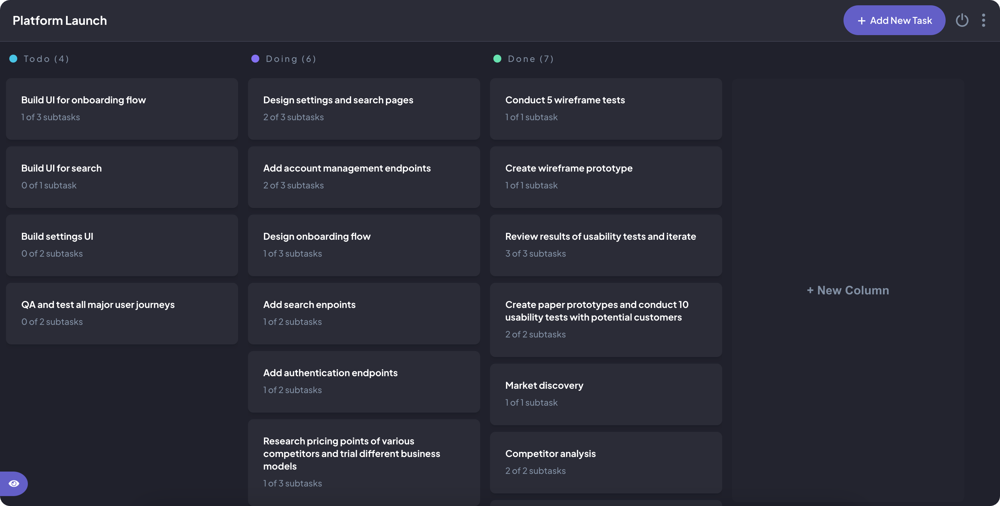

## Task Manager

<a href="https://my-task-manager.web.app" markdown="1">

</a>

Task management web application.

https://my-task-manager.web.app

### Usage

Create your scheduled tasks and manage them by defining their :

- Name
- Description
- Subtasks
- Status

### Built With

##### Languages

- React
- Redux
- Typescript
- Sass

##### Testing

- Jest
- Testing library

##### Backend

- Firebase

##### Library

- React-beautiful-dnd
- React-hook-form
- React-router
- React-modal
- Dnd-kit

##### Method

- Mobile first
- Cross-browser
- Accessibility
- BEM

## Getting Started

To run the project follow these simple steps.

### Installation

1. Clone the repo

```sh
git clone https://github.com/Nicolas-dlb/task-manager
```

2. install dependances

```sh
npm install
```

3. run the project

```sh
npm run dev
```

### Tests

run unit tests

```sh
npm test
```

## Contact

Nicolas Dubois - [@Linkedin](https://www.linkedin.com/in/nicolasdlb) - nicolas_db@outlook.fr

Project Link: [https://github.com/Nicolas-dlb/task-manager](https://github.com/Nicolas-dlb/task-manager)
